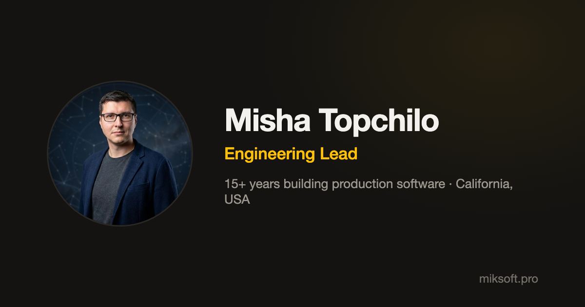

# miksoft.pro

[](https://github.com/miksrv/miksoft.pro/actions/workflows/checks.yml)
[](https://github.com/miksrv/miksoft.pro/actions/workflows/deploy.yml)
[](https://sonarcloud.io/summary/new_code?id=miksrv_miksoft.pro)

Source code of my personal website — **[miksoft.pro](https://miksoft.pro)**. A short, quiet one-page resume: who I am, what I'm doing now, experience, projects and stack.



## Features

- One static page, no tracking widgets or vanity metrics
- Dark / light theme without a flash on load
- Printable resume (`Resume (PDF)` → browser print) and a downloadable vCard
- Email is never present as plain text in the HTML
- All content lives in a single [`public/data.json`](./public/data.json)

## Stack

Next.js 16 (static export) · React 19 · TypeScript · Sass modules · Jest + Testing Library

## Getting started

```bash
yarn install
yarn dev      # http://localhost:3000
yarn test
yarn build    # static site in /out
```

Requires Node.js 20 (see `.nvmrc`) and Yarn 4.

## Previous version

The earlier multi-section portfolio template (v1.x – v2.x) lives in
[miksrv/developer-portfolio-website](https://github.com/miksrv/developer-portfolio-website).

## License

[MIT](./LICENSE) © Misha Topchilo
